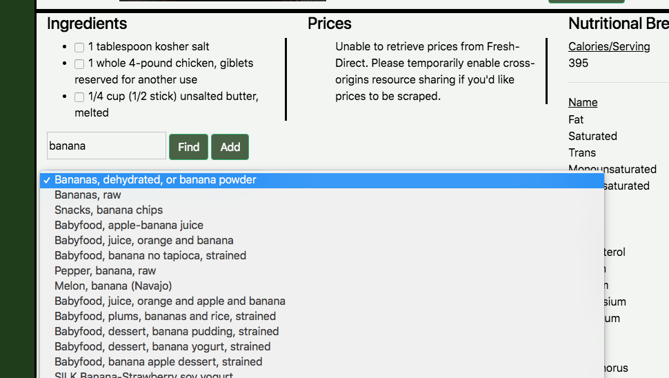

# Foogle

### Overview

Foogle is a front-end API-driven recipe search engine that allows the user to type in a food search criteria and to filter that criteria further by checking off any food preferences/allergens.

Foogle allows a user to bookmark detailed custom recipe pages via local storage.  Each page features ability to customize ingredients lists while obtaining real-time pricing and nutrient breakdown updates.  

Foogle is your convenient one-stop solution to finding and logging these recipes.

### Prerequisites

Foogle features the use of web scraping to pull in prices from an outside website - [FreshDirect](https://www.freshdirect.com/). Since we are accessing an outside domain to fulfill this request from the front-end, and since web browsers typically don't allow this under the standard same-origin policy, we need to enable cross-origin resource sharing (CORS) to see this feature in action.  

Using the link below, you can download the CORS chrome-plugin.  Temporarily enable it to allow cross-origin resource sharing. Make sure you disable it after you are done using Foogle as it is typically disabled as an extra web security layer.

[CORS](https://chrome.google.com/webstore/detail/allow-control-allow-origi/nlfbmbojpeacfghkpbjhddihlkkiljbi) 

### How it Works

Upon searching and choosing a suggested recipe item, Foogle will return the user to a second page filled with possible food recommendations laid out in a card collection format.  The user may scroll through and peruse these cards until a particular item catches the user's eye. 

Once an item is chosen by the user, the website will pull up a detailed breakdown of the recipe item (it does this by calling out to the [Edamam Recipe Search API](https://developer.edamam.com/)).  The details include: food ingredients, pricing, and general nutrient breakdown.  The user is given the ability to update food items and see how it impacts the recipe in real time.  The final state of the modifications may be bookmarked using Foogle's "Save Recipe" feature.

### Challenges & Stretch Goals

#### API Access Level

We did not see the restrictions to the number of search ingredients that could be included into the API call until the project was mostly done, as such we have extra ingredients that we cannot actually search with due to only having a "Developer" level access.  If upgraded, the rest of the ingredients should work as intended.

#### Differing Search Criterias

The search criterias used by our three resources use different general formatting.  The Edamame Recipe API, the USDA API, and FreshDirect all have different search and search result formats, thus we had to create functions that filtered the formats to a standard so that all three could 'understand' each other.  This proved difficult and though we got pretty close in most cases, there are still errors that may crop up from time to time that would need continued maintenance to eliminate.  We also forced the user to choose the USDA API search criteria using nested API calls, please see screenshot below for an example of this in action.

Though we got most of the features functioning pretty well, to perfect the features would be extremely time consuming, and so we considered any further improvements to this system to be stretch goals for the project.

#### FreshDirect Domain Blocking

Once we got the web scraping implemented, we had the script automating the scraping of HTML search results off of the FreshDirect website.  As we were debugging, our computer's were constantly pinging the web server for these results.  Due to the frequency of search calls, FreshDirect seems to have temporarily blocked us from accessing their site.  If not on the FreshDirect block list, the user should have no issue using our scrape feature.  

Due to having been blocked during the debugging portion of this module, we did not fully implement the layout and filtering required to perfect this feature.  If this had also had a back-end, we would have worked around this by storing the pinged data so as not to have to call out to FreshDirect so often.

#### Saving User Information

Due to this being only a front-end project, we had to use localstorage features to pass information between pages.  Due to the nature of our project, we had to pass a good bit of information to each page.  All of our intended features are functional so we were able to get by with a bit of creative implementation.

#### Nutrition Formatting Disparity

Like #2, we had different search results being returned by both APIs, so result standard formatting functions were written which work in the majority of test cases.

## Video Demo & Related Video Notes

[Foogle YouTube Demo](https://www.youtube.com/watch?v=bvVTjf4jlvs&feature=youtu.be)

### Additional Video Notes

[00:19](http://www.youtube.com/watch?v=bvVTjf4jlvs&t=0m19s) - Due to our 'Developer' level of API access privilege, only 10 recipe filters are enabled

[00:48](http://www.youtube.com/watch?v=bvVTjf4jlvs&t=0m48s) - Enable CORS to view pricing.  Access is denied in the example due to temporary blocking from the Fresh-Direct domain.

[01:15](http://www.youtube.com/watch?v=bvVTjf4jlvs&t=1m15s) - Watch as the nutritional breakdown section updates using USDA API data when a new food item is added.

## Technologies Employed

HTML, CSS, Bootstrap, jQuery, JavaScript, Recipe & USDA APIs, Web Scraping via FreshDirect, AWS

## Authors

[Eric Ridenour](https://github.com/etridenour)

[Matthew Fisher](https://github.com/MicroFish91)

[Travis Ramos](https://github.com/tramos5)
